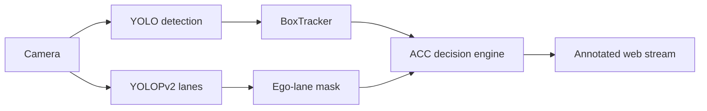

# Camera ACC Demo

Real-time adaptive cruise control from a single forward-facing camera — YOLO detection, YOLOPv2 lane tracking, and an advisory brake/speed HUD, served headless in the browser.


## What it does

A live camera feed is turned into a driving-assistance overlay. Every vehicle, pedestrian, traffic sign, and traffic light is detected and tracked; distances are estimated with a pinhole camera model; the ego lane is traced from YOLOPv2 lane masks; and a decision engine produces an advisory action — `HEAVY_BRAKE`, `LIGHT_BRAKE`, or `NO_SUGGESTION` — rendered on top of the stream.

## Features

- **Unified YOLO detection** — one model for 8 classes: car, truck, bus, motorcycle, bicycle, person, traffic sign, traffic light.
- **Pinhole distance estimation** — per-class reference heights turn bounding-box size into metres.
- **Dynamic ego-lane tracking** — YOLOPv2 lane masks are reduced to a drivable lane, locked only where both edges are actually visible.
- **Hazard reasoning** — closing-rate braking, crosswalk and jaywalking pedestrians, and crossing traffic at intersections.
- **Headless web UI** — the annotated stream is served over HTTP; no display window required.

## Screenshots


## Demo

<video controls src="docs/videos/demo.mp4"></video>

*Player not rendering? Open [docs/videos/demo.mp4](docs/videos/demo.mp4).*

## How it works



1. **Detect** — the unified model localises the 8 classes every frame.
2. **Track** — `BoxTracker` associates detections across frames and estimates lateral and vertical motion.
3. **Measure** — distance comes from bounding-box height and the pinhole focal length.
4. **Lane** — the YOLOPv2 lane mask is scanned bottom-up to extract a per-row ego lane.
5. **Decide** — closing rate, crosswalk and jaywalker hazards, and crossing traffic set the advisory action.

## Quick start

```bash
pip install -r requirements.txt
# plus the PyTorch backend for your hardware (see below)
python camera_demo_acc_web.py
```

Open http://localhost:5000.

| Flag | Default | Description |
|------|---------|-------------|
| `--camera` | `0` | Camera device index |
| `--width` | `1280` | Capture width |
| `--height` | `720` | Capture height |
| `--imgsz` | `640` | Detection inference size |

All tunables — weights path, focal length, ACC zones, hazard thresholds — live in the `CONFIG` section at the top of `camera_demo_acc_web.py`.

## Model weights

The two model files are committed directly in `weights/` (no longer gitignored):

| File | Purpose |
|------|---------|
| `weights/yolo12m_vistas_best.pt` | YOLO detection (8 classes) |
| `weights/yolopv2.pt` | YOLOPv2 lane detection |

## Hardware backends

`requirements.txt` pins `ultralytics` and `flask`. Install the PyTorch backend for your hardware:

| Backend | Command |
|---------|---------|
| NVIDIA CUDA | `pip install torch torchvision` |
| AMD ROCm (RX 7000) | `pip install torch torchvision --index-url https://download.pytorch.org/whl/rocm6.2` |
| CPU only | `pip install torch torchvision --index-url https://download.pytorch.org/whl/cpu` |

## Project layout

```
.
├── camera_demo_acc_web.py   # active demo application
├── main.py                  # training pipeline
├── train_*.py               # training variants
├── build_dataset.py         # Roboflow dataset builder
├── *_to_yolo.py             # dataset converters
├── weights/                 # model weights (committed)
├── docs/                    # docs assets
│   ├── images/              # screenshots
│   └── videos/              # demo video
├── requirements.txt
├── .env.example
└── archive/                 # superseded demos, datasets, eval scripts
```

## Training & datasets

Training and dataset-building scripts are kept at the root (`main.py`, `train_*.py`, `build_*.py`, `*_to_yolo.py`). They require extra dependencies beyond the demo runtime: `roboflow`, `matplotlib`, `onnxruntime`. Set `ROBOFLOW_API_KEY` in `.env` (copy `.env.example`) for the Roboflow-based builders.
